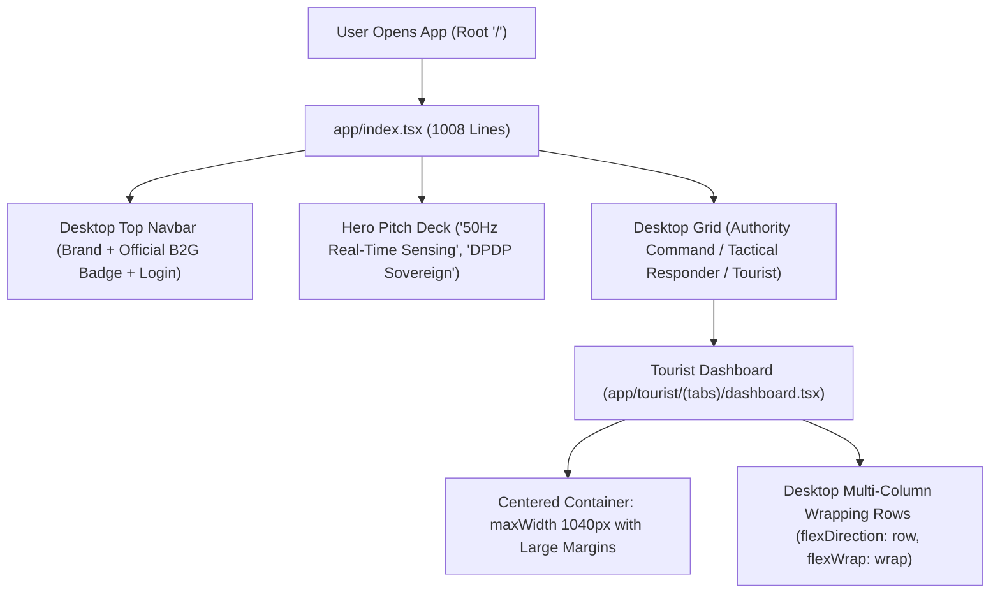
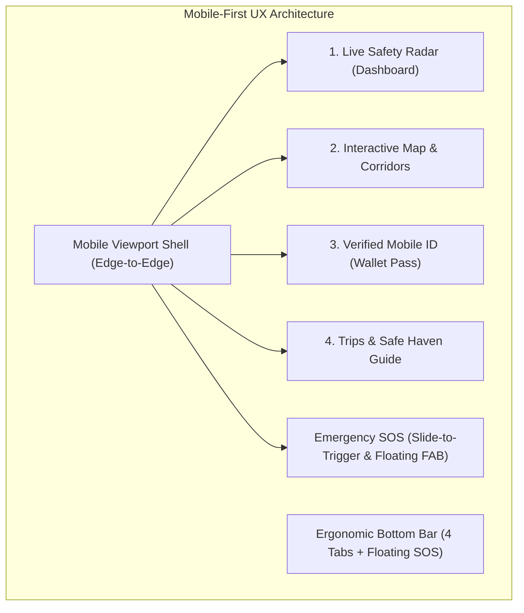
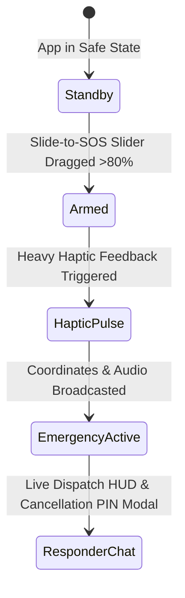
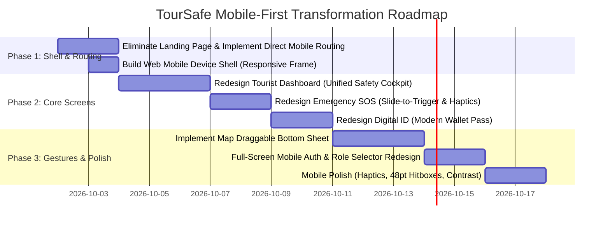

# TourSafe Mobile-First Redesign & Forensic Audit Report

**Date:** October 2026  
**Project:** TourSafe Mobile Companion (`frontend/`)  
**Target Platform:** React Native / Expo (iOS, Android, Web Preview)  
**Author:** AI Engineering & Mobile UI Architecture Team  

---

## Executive Summary

TourSafe is conceived as an **instant, high-stakes personal safety companion and emergency dispatch platform** for travelers and authorities. However, the current frontend codebase suffers from three fundamental architectural and visual issues:

1. **Website Design Paradigm:** The application is built like a desktop B2B/B2G marketing portal with a 1,008-line web landing page at root, desktop split-pane views, fixed `maxWidth: 1040` containers, multi-column wrapping grids, and top-heavy desktop navigations.
2. **"AI Slop" Aesthetic:** The UI exhibits classic automated template symptoms: literal skeuomorphic credit cards with fake gold EMV chip lines, "card-inside-card" metric soup, raw hardware physics sensor dumps (0.98 G accelerometer decibel readouts), and dense walls of corporate buzzwords ("Zero-Trust ISO 27001", "DPDP Sovereign", "Acoustic coordinates").
3. **Lack of Mobile-First Ergonomics:** Critical high-stakes operations (Emergency SOS, checking current zone safety, calling police) fail thumb-zone reachability, lack native interaction gestures (such as swipe-to-activate, bottom sheets, and haptics), and suffer from small touch targets and vertical scroll fatigue.

This report delivers a **detailed audit of the existing frontend codebase** followed by an **actionable, screen-by-screen architectural blueprint** to transform TourSafe into a world-class, native mobile-first travel safety companion.

---

# Part 1: Forensic Audit of the Existing Design

### 1.1 Architectural & Route Inventory

| Route / File | Physical Lines | Primary Current Role | Core Aesthetic & Mobile Defect |
| :--- | :--- | :--- | :--- |
| [app/index.tsx](file:///c:/Users/Lenovo/Downloads/toursafe-react/frontend/app/index.tsx) | 1,008 lines | App root entry point | **Desktop Marketing Landing Page:** Full-width website navbar, hero pitch deck, 4-column metric strip, and 3-column "Operational Workspaces" card grid. Squeezed and unusable on mobile. |
| [app/auth/login.tsx](file:///c:/Users/Lenovo/Downloads/toursafe-react/frontend/app/auth/login.tsx) | 603 lines | User authentication | **Desktop Split-Pane:** Fixed left sidebar with corporate marketing copy and security badges (`width < 900` check), creating an awkward stacked form on phones. |
| [app/tourist/(tabs)/dashboard.tsx](file:///c:/Users/Lenovo/Downloads/toursafe-react/frontend/app/tourist/(tabs)/dashboard.tsx) | 1,697 lines | Tourist Home Screen | **Desktop Container with Metric Soup:** `maxWidth: 1040` centered in whitespace, wrapping multi-column flex rows (`heroRow`, `statusGrid`), cluttered with 8+ nested cards and raw sensor telemetry. |
| [app/tourist/(tabs)/sos.tsx](file:///c:/Users/Lenovo/Downloads/toursafe-react/frontend/app/tourist/(tabs)/sos.tsx) | 1,252 lines | Emergency Action Hub | **High Cognitive Friction:** Giant idle SOS button requires a 5-second countdown with text boxes, flanked by a 400-word essay on "What Happens When SOS is Triggered?", and manual phone dial cards. |
| [app/tourist/(tabs)/digital-id.tsx](file:///c:/Users/Lenovo/Downloads/toursafe-react/frontend/app/tourist/(tabs)/digital-id.tsx) | 1,578 lines | Digital Identity Pass | **Literal Fake Credit Card:** Recreates a physical plastic credit card with gold EMV chip lines, embossed card numbers, and WiFi waves. Includes top desktop segment tabs (`credential`, `kyc`, `privacy`). |
| [app/tourist/(tabs)/map.tsx](file:///c:/Users/Lenovo/Downloads/toursafe-react/frontend/app/tourist/(tabs)/map.tsx) | 970 lines | Geospatial Map | **Top-Heavy HUD:** Top-anchored floating cards obstructing the map view. Lacks a native swipeable bottom sheet for POIs and safe zones. |
| [components/sos/SosGuardCard.tsx](file:///c:/Users/Lenovo/Downloads/toursafe-react/frontend/components/sos/SosGuardCard.tsx) | 1,339 lines | Kinematic SOS Sensor Card | **Raw Telemetry Dumping:** Displays raw accelerometer G-forces, gyroscope rates, and acoustic decibel meters in a traveler dashboard instead of ambient protection state. |

---

### 1.2 Deep-Dive: Concern #1 — Why It Looks Like a Website



1. **Desktop Landing Page as Mobile Root:**
   Instead of launching into a mobile splash screen or direct mobile dashboard, `app/index.tsx` serves as a traditional desktop B2B sales page. A mobile traveler in distress would see a marketing pitch for the platform rather than their safety companion.
2. **Fixed Desktop Width Constraints:**
   Throughout `dashboard.tsx`, `sos.tsx`, and `digital-id.tsx`, every view is wrapped in:
   ```typescript
   mainWrapper: {
     width: "100%",
     maxWidth: 1040, // or 880px
     alignSelf: "center",
   }
   ```
   When viewed on a mobile viewport or mobile simulator, this pattern introduces desktop padding artifacts (`paddingHorizontal: 16`), centered letterboxing, and prevents edge-to-edge mobile UI design.
3. **Multi-Column Wrapping Grids:**
   The `heroRow` in `dashboard.tsx` (lines 1066–1075) declares:
   ```typescript
   heroRow: {
     flexDirection: "row",
     flexWrap: "wrap",
     gap: 16,
   },
   safetyCard: {
     flex: 1,
     minWidth: 320,
   }
   ```
   On a mobile screen with 375px–390px width, `minWidth: 320` immediately triggers flex wrapping, resulting in inconsistent vertical stacking with excessive margins and broken visual rhythms.
4. **Split-Screen Desktop Auth:**
   `app/auth/login.tsx` attempts to be responsive with `width < 900`, dividing the screen into `leftPane` (desktop branding showcase) and `rightPane` (login form). On mobile phones, this renders as a clumsy vertically stacked block of promotional text before the user can even reach the email input.

---

### 1.3 Deep-Dive: Concern #2 — Why It Looks Like "AI Slop"

"AI Slop" in frontend design refers to the robotic generation of generic, over-elaborate boilerplate components that mimic trendy buzzwords without regard for real-world usability:

1. **Literal Skeuomorphic Credit Card in `digital-id.tsx`:**
   In [app/tourist/(tabs)/digital-id.tsx](file:///c:/Users/Lenovo/Downloads/toursafe-react/frontend/app/tourist/(tabs)/digital-id.tsx#L384-L425), instead of designing a modern digital credential pass (like Apple Wallet, Google Wallet, or DigiLocker), the code literally constructs a plastic credit card in CSS:
   ```typescript
   // EMV Gold Chip simulation with lines
   <View style={styles.emvChip}>
     <View style={styles.chipLine1} />
     <View style={styles.chipLine2} />
     <View style={styles.chipInner} />
   </View>
   // Rotated WiFi waves for 'RFID'
   <Wifi size={20} color="#FFFFFF" style={{ transform: [{ rotate: "90deg" }] }} />
   // Embossed card numbers
   <Text style={styles.cardNumberText}>TS-7849 •••• •••• 9012</Text>
   ```
   This is an artificial, skeuomorphic gimmick that screams AI prompt output and degrades the app's credibility.
2. **Dense Sensor & Telemetry Dumps:**
   In [components/sos/SosGuardCard.tsx](file:///c:/Users/Lenovo/Downloads/toursafe-react/frontend/components/sos/SosGuardCard.tsx#L346-L380), the UI exposes internal machine learning and physics variables directly to the end user:
   * `ACCELEROMETER: 0.98 G (TRIGGERED)`
   * `GYROSCOPE: 0.12 rad/s`
   * `ACOUSTIC SENSOR: 42 dB`
   * `50Hz REAL-TIME SENSING`
   A tourist does not need an avionics flight recorder; they need to know: **"Is my fall detection active? Yes/No."**
3. **Buzzword Overload & Cluttered Microcopy:**
   The interface is inundated with jargon that distracts from core utility:
   * *"Cryptographic Nonce Rotated: Anti-replay protection token refreshed successfully"*
   * *"Mesh Relay Active: SOS is cryptographically signed and queued for transmission over peer-to-peer cellular fallback"*
   * *"ZERO-TRUST ISO 27001"*
   * *"DPDP Sovereign"*
4. **"Metric Box Soup":**
   Every screen features identical nested cards: an icon in a rounded square (`width: 42, height: 42`), a kicker in uppercase 10px font, a bold title, an explanation paragraph, a status badge pill, and a ChevronRight icon.

---

### 1.4 Deep-Dive: Concern #3 — Why It Fails Mobile-First Design

```
+------------------------------------+
| [Top Bar: Role Switch + Badges]    | <-- UNREACHABLE (Top Danger Zone)
| [Hero Status Banner]               |
|                                    |
| [Safety Shield Card]               |
|                                    |
| [Emergency Response Card]          | <-- Natural Thumb Resting Zone
|                                    |     (Occupied by text paragraphs)
| [Digital ID Banner]                |
| [Telemetry Cockpit]                |
| [Live Map Access]                  |
| [Bottom Tab Bar: Home/Map/SOS/ID]  | <-- Accessible Thumb Zone
+------------------------------------+
```

1. **Thumb Zone Ergonomics Inverted:**
   * In a mobile emergency application, high-stakes primary actions must sit within the lower 40% of the screen (the natural sweep of the thumb).
   * In `dashboard.tsx` and `sos.tsx`, primary emergency buttons and status triggers are buried beneath welcome banners, connection pills, role switches, and marketing headers.
2. **5-Second Text Countdown vs. Native Gestural Triggers:**
   * In `sos.tsx`, triggering SOS involves tapping a button, followed by a 5-second digital timer with a tiny "ABORT" button. If a traveler is running, injured, or panicked, typing or hunting for an abort button is hazardous.
   * Native mobile standards require a **"Slide to Trigger Emergency SOS"** slider (similar to iOS Power Down or Emergency Call) with progressive haptic feedback.
3. **Absence of Native Mobile UI Primitives:**
   * **No Gestural Bottom Sheets:** In `map.tsx`, zones and police kiosks are viewed via fixed top cards and small category scrollbars rather than an interactive, draggable bottom sheet (e.g., Apple Maps / Google Maps pattern).
   * **No Haptic Feedback Hierarchy:** Physical feedback via `expo-haptics` is virtually absent in routine interactions, making the app feel like a static webpage.
   * **Tiny Touch Targets:** Filter chips, back buttons, and helpline cards have hitboxes under 36px, violating Apple HIG and Android Material guidelines (minimum 44x44pt / 48x48dp).

---

# Part 2: The New Mobile-First Design Blueprint



---

## 2.1 Design System Foundations & Ergonomics

### A. Viewport Shell & Web Preview Container
To ensure seamless operation on both physical devices and web development previews:
* **Native (iOS/Android):** True 100% edge-to-edge layout using `react-native-safe-area-context` (`useSafeAreaInsets()`).
* **Web Preview (`Platform.OS === 'web'`):** A modern mobile device frame (390px × 844px aspect ratio with subtle bezel and drop shadow) centered on the desktop screen. This prevents the app from stretching into an awkward desktop website while developing locally.

### B. Curated Mobile Color Tokens
Move away from generic Tailwind colors to a dedicated, high-contrast palette:

| Token | Hex | Role | Semantic Meaning |
| :--- | :--- | :--- | :--- |
| `surface-base` | `#0B0F19` (Dark) / `#F8FAFC` (Light) | App Background | Clean canvas, battery saving |
| `surface-card` | `#131C2E` (Dark) / `#FFFFFF` (Light) | Card & Sheet Surface | High contrast, tactile elevation |
| `safety-emerald` | `#059669` (Dark: `#10B981`) | Safe / Shield Active | Verified safety, normal status |
| `safety-amber` | `#D97706` (Dark: `#F59E0B`) | Caution / Elevated Watch | Approaching unlit or isolated zone |
| `sos-crimson` | `#DC2626` (Dark: `#EF4444`) | Immediate Emergency | Deliberate SOS trigger, active alert |
| `primary-azure` | `#0284C7` (Dark: `#38BDF8`) | Actions & Navigation | Primary interactive elements |

### C. Touch Targets & Typography Scale
* **Minimum Tap Target:** `48 × 48 pt` for all interactive elements.
* **Typography:** System fonts (`-apple-system, Roboto, Inter`) with tight line heights and high-contrast weights:
  * Display Header: 24pt Bold (-0.5 tracking)
  * Section Title: 18pt SemiBold
  * Body Text: 14pt Regular (high legibility)
  * Micro/Badge: 11pt Bold (+0.5 tracking)

---

## 2.2 Screen-by-Screen Mobile Redesign

### Screen 1: App Root & Authentication (`app/index.tsx` & `app/auth/login.tsx`)
**Current:** 1,008-line desktop marketing landing page + split-screen web login.  
**Redesign:**
1. **Direct Session Routing:** `app/index.tsx` detects authentication state immediately:
   * Authenticated $\rightarrow$ Direct jump to `/tourist/(tabs)/dashboard`.
   * Unauthenticated $\rightarrow$ Sleek full-screen Mobile Welcome Sheet.
2. **Full-Screen Mobile Auth:**
   * Clean vertical mobile layout with high-contrast inputs.
   * 1-Tap Role Selector Pills (Tourist / Responder / Command) at top with smooth sliding indicator.
   * Quick-access biometric simulation button ("Continue with Face ID / Passkey").
   * Zero desktop marketing sidebars or corporate pitch text.

---

### Screen 2: Tourist Home Dashboard (`dashboard.tsx`)
**Current:** Cluttered 1,700-line web grid with 8 cards, telemetry cockpit, and greeting banners.  
**Redesign:** Focus on 3 essential questions: **"Am I safe right now?", "Where am I?", and "How do I get help?"**

```
+------------------------------------+
| 🟢 Kodaikanal Lake Safe Zone   (i) | <-- Glanceable Status Capsule
|                                    |
| [  LIVE SAFETY RADAR COCKPIT     ] |
| • Shield Status: ACTIVE & SECURED  | <-- Single high-contrast status card
| • Battery: 95% | GPS Lock: ±4m     |     with pulsing radar ring
|                                    |
| [ QUICK DIAL ASSIST (112 • 108)  ] | <-- Horizontal 1-tap pill row
|                                    |
| [ ACTIVE TRIP: Pine Forest Trek  ] | <-- Single compact journey card
| Next Stop: Pillar Rocks (1.4 km)   |
|                                    |
| >>> SLIDE FOR EMERGENCY SOS >>>    | <-- Thumb-zone persistent slider
+------------------------------------+
| [Home]   [Map]   (SOS)   [ID]   [Me] | <-- Bottom Tab Bar
+------------------------------------+
```

* **Glanceable Status Capsule:** Top header shows current zone name with colored indicator (Green: Safe Haven, Amber: Caution Area, Red: Restricted).
* **Unified Safety Radar:** Combines IMU, GPS, and Cloud sync into a single cohesive visual: an ambient breathing ring indicating "All Systems Normal" instead of 4 separate raw diagnostic boxes.
* **Quick Assistance Row:** Large 48pt tap targets for 112 (Police) and 108 (Ambulance) with direct native phone linking.
* **Compact Active Trip Card:** Shows destination and distance to next checkpoint without redundant table columns.

---

### Screen 3: Emergency SOS Experience (`sos.tsx` & `SosGuardCard.tsx`)
**Current:** Giant tap button $\rightarrow$ 5-second countdown text box $\rightarrow$ dense 400-word explanation.  
**Redesign:**



1. **Slide-to-Trigger SOS Slider:**
   * Replaces accidental button taps and tedious text timers.
   * User slides a crimson emergency shield icon across the bottom thumb-zone.
   * Incremental haptic vibration triggers as the slider progresses (25%, 50%, 75%, 100%).
2. **Instant Full-Bleed Emergency HUD:**
   * Screen shifts to high-contrast emergency mode.
   * Real-time GPS coordinates, altitude, and battery displayed prominently for reading to an operator.
   * Direct "Call Dispatcher (112)" prominent button.
3. **Stand-Down Cancellation with PIN/Reason Sheet:**
   * Swipe up to cancel with a quick-tap reason picker ("Accidental Trigger", "Situation Resolved", "Test").
4. **Ambient SosGuardCard:**
   * Remove raw G-force and gyroscope gauges. Replace with a single clean card: **"Automatic Fall & Impact Guard: Armed"** with a sensitivity slider (Normal / High / Adventure Mode) inside an expandable bottom sheet.

---

### Screen 4: Verified Tourist Digital ID (`digital-id.tsx`)
**Current:** Skeuomorphic plastic credit card with fake gold EMV chip, faux embossed lines, and top web tabs.  
**Redesign:**

```
+------------------------------------+
| TOURSAFE TRAVEL PASS      [Gov Seal]
|                                    |
| [Dynamic QR Code with Security Ring]
| Validated by Ministry of Tourism   |
|                                    |
| ADITYA VERMA                       |
| TS-IND-8842-2026                   |
| Validity: 12/2028 • KYC: Verified  |
|                                    |
| [ Add to Apple / Google Wallet ]   |
| [ Share Verified Pass with Hotel ] |
+------------------------------------+
```

1. **Mobile Wallet Pass Architecture:**
   * Clean, elegant digital travel credential inspired by Apple Wallet and DigiLocker.
   * Prominent dynamic QR code with rotating anti-replay token.
   * Official government verification checkmark with zero fake plastic textures or pseudo-chip lines.
2. **Native Action Sheet:**
   * "Add to Apple Wallet / Google Wallet" button.
   * "Present Offline QR" full-brightness toggle.
   * "Privacy & Consent Settings" presented in a native slide-up sheet rather than a desktop tab bar.

---

### Screen 5: Live Safety Map & Corridor Explorer (`map.tsx`)
**Current:** Map covered by bulky top header cards, horizontal category chips, and static layouts.  
**Redesign:**

1. **Full-Bleed Map Canvas:** The map occupies 100% of the screen.
2. **Minimalist Floating HUD:**
   * Top-left: Compact search/zone badge.
   * Top-right: Floating action stack (Recenter GPS, Layer Toggle, Satellite).
3. **Interactive Draggable Bottom Sheet:**
   * **Collapsed State (Peeking 80pt):** Shows current zone status ("In Kodaikanal Lake Safe Haven") and nearest police kiosk distance.
   * **Half-Expanded State (320pt):** Displays nearby safe spots, police kiosks, and hospital pins in a clean swipeable carousel.
   * **Full-Expanded State:** Full list of safety corridors, danger warnings, and active itinerary waypoints.

---

## 2.3 Proposed Mobile Information Architecture

```
frontend/
├── app/
│   ├── _layout.tsx                     # Global Root Providers, Safe Area & Device Shell
│   ├── index.tsx                       # Smart Entry: Direct auth check & routing (No landing page)
│   ├── auth/
│   │   ├── login.tsx                   # Clean Mobile Full-Screen Auth (Tourist/Responder/Admin)
│   │   └── register.tsx                # Mobile 3-step KYC onboarding
│   └── tourist/
│       ├── _layout.tsx                 # Stack navigator
│       └── (tabs)/
│           ├── _layout.tsx             # Ergonomic 4-Tab Bottom Bar + Center Floating SOS
│           ├── dashboard.tsx           # Mobile Safety Cockpit (Unified Status Radar)
│           ├── map.tsx                 # Full-Screen Map with Draggable Bottom Sheet
│           ├── sos.tsx                 # Slide-to-Trigger Emergency Hub
│           ├── digital-id.tsx          # Mobile Wallet Pass (No fake credit cards)
│           └── profile.tsx             # Traveler Profile & Emergency Contacts
├── components/
│   ├── mobile/
│   │   ├── MobileDeviceFrame.tsx       # Web preview shell (simulates iPhone/Pixel on web)
│   │   ├── SlideToTriggerSOS.tsx       # Haptic-enabled emergency slider
│   │   ├── MobileSafetyRadar.tsx       # Glanceable ambient safety ring
│   │   ├── WalletPassCard.tsx          # Clean modern digital identity pass
│   │   └── DraggableBottomSheet.tsx    # Native-feeling gesture sheet for Map & POIs
│   └── sos/
│       └── SosGuardCard.tsx            # Cleaned ambient sensor card (no raw physics dumping)
```

---

## 2.4 Step-by-Step Implementation Roadmap



### Phase 1: Shell & Routing Transformation
1. **Reroute App Entry:** Modify `app/index.tsx` so it no longer serves as a 1,000-line desktop landing page. Make it an instant dispatcher that directs tourists straight into `app/tourist/(tabs)/dashboard` or mobile login. (The authority portal can remain accessible via a dedicated route `/admin` or developer switcher).
2. **Mobile Viewport Frame for Web (`npm run web`):** Implement a responsive wrapper component that wraps the app in a realistic mobile viewport (390px width) when viewed on desktop browsers, so developers and testers experience true mobile dimensions.

### Phase 2: Core Screen Redesign
1. **Dashboard Transformation:** Strip out multi-column wrapping grids and `maxWidth: 1040`. Implement the **Glanceable Status Capsule**, **Unified Safety Radar**, and horizontal **Quick Assistance Row**.
2. **Emergency SOS & Slide-to-Activate:** Replace the 5-second countdown text timer in `sos.tsx` with `SlideToTriggerSOS.tsx`. Clean up `SosGuardCard.tsx` to hide raw accelerometer numbers behind an optional developer/debug toggle.
3. **Digital Wallet ID Pass:** Completely rewrite `digital-id.tsx` card face: eliminate the faux gold EMV chip lines, faux embossed numbers, and WiFi waves. Implement a sleek, authoritative government-recognized digital pass with dynamic QR code.

### Phase 3: Gestural Mobile Controls & Polish
1. **Interactive Map Bottom Sheet:** Refactor `map.tsx` to full-bleed view with a draggable bottom sheet for safe corridors and nearby police/medical aid posts.
2. **Full-Screen Mobile Auth:** Overhaul `login.tsx` to eliminate the left desktop marketing pane and deliver a swift, thumb-friendly login flow.
3. **Touch Targets & Haptic Feedback:** Ensure all touch targets meet the $\ge 48\text{pt}$ standard and integrate contextual haptic feedback on tab changes, SOS gestures, and mode switches.

---

## 2.5 Verification & Acceptance Criteria

| Area | Acceptance Test | Success Criterion |
| :--- | :--- | :--- |
| **Initial Launch** | Launch app via `npm run web` or on mobile device | Opens directly into mobile dashboard or mobile auth sheet. No desktop marketing website is displayed. |
| **Mobile Ergonomics** | Measure tap target sizes across all screens | All buttons, tabs, and action pills are $\ge 48 \times 48\text{ pt}$. Primary actions lie within thumb zone. |
| **Emergency SOS** | Trigger emergency dispatch from home or SOS screen | Triggered via smooth deliberate slide gesture with progressive haptics. Zero accidental taps; zero 5-second countdown delays. |
| **Digital Identity** | Inspect Digital ID tab | Displays modern wallet pass with verified QR code. No fake skeuomorphic plastic credit card chips or embossed text. |
| **Map Usability** | Interact with map in `map.tsx` | Map is 100% full-screen edge-to-edge. Safety zones and police POIs open via a smooth bottom sheet. |
| **Code Cleanliness** | Codebase review | Redundant marketing copy and raw physics sensor variables removed from traveler-facing views. |

---

*Report prepared and documented for TourSafe Mobile Transformation.*
